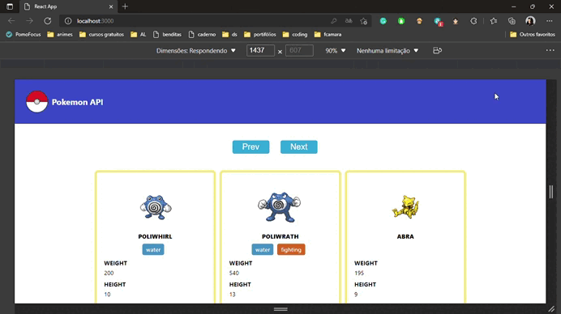

> **EM DESENVOLVIMENTO!** :woman_technologist:
# Pokemon API


<h1 align="center">
    
</h1>

<ol>
    <li><a href="#sobre">Sobre</a></li>
        <li> <a href="#requisitos">Requisitos</a></li>
        <li> <a href="#comorodaroprojeto">Como Rodar o Projeto?</a> </li>
        <li> <a href="#resultados"> Resultados de Desenvolvimento</a> </li>
        <li> <a href="#referencias">Referências</a></li>
</ol>

<h2 id="sobre">Sobre</h2> 

A ideia central desse projeto é a construção de um Front-end em React JS para o consumo de uma API. Para isso, foi escolhida a [PokéApi v2](https://pokeapi.co/docs/v2).

<h2 id="requisitos">Requisitos</h2> 

Possuir o [Node Js](https://nodejs.org/en/) instalado em sua máquina.

<h2 id="comorodaroprojeto">Como Rodar o Projeto?</h2> 

``` bash
#Clone este repositório
$ git clone https://github.com/eireneof/pokemon-api.git

#Abra a pasta pokemon-api e no terminal execute o comando:
$ cd pokemon-api
$ npm install

#Em seguida deixe a aplicação “rodando” através do comando abaixo:
$ npm start

#A aplicação(frontend) será aberta na porta:3000 - acesse http://localhost:3000. 

```

<h2 id="resultados">Resultados de Desenvolvimento</h2> 

<h3 align="center">
    
</h3>


* Como a aplicação é de nível iniciante, ela é simples, mas está voltada para o uso de alguns conceitos base para o consumo de uma API em React. Como por exemplo, o uso de `useState` e `useEffect`.

``` javascript
  //exemplos do uso do useState para controlar a coleta de dados de cada pokemon, o próximo endpoint, o anteriaor e também o carregamento da página (respectivamente)
  const [pokemonData, setPokemonData] = useState([]);
  const [nextUrl, setNextUrl] = useState('');
  const [previousUrl, setPreviousUrl] = useState('');
  const [loading, setLoading] = useState(true);

```


``` javascript
    //exemplo do useEffect para o carregamento dos pokemons especificados
    useEffect(() => {
      async function fetchData() {
        let response = await getAllPokemon(initialUrl); //recebo a princípio todos os dados do endpoint principal (initialUrl)
      console.log(response);
      setNextUrl(response.next); //reservo o próximo endpoint
      setPreviousUrl(response.previous); //reservo o anterior
      let pokemon = await loadingPokemon(response.results); //crio um array com todos os pokemons disponibilizados por esse endpoint
      console.log(pokemon);
      setLoading(false); //mudo setLoandin() para falso, pois os dados já foram carregados
    }
    fetchData();
  }, []);

```

* `getAllPokemon(url)` e `getPokemon(url)` são as funções que estão presentes na camada de [serviço](https://github.com/eireneof/pokemon-api/blob/main/src/services/pokemon.js), ambas retornam uma `Promise`, mas a primeira está relacionada a um conjunto de pokemons, enquanto a outra retorna apenas um. 

<h3 align="center">
  
</h3>

<h2 id="referencias">Referências</h2> 

* A aplicação foi desenvolvida de acordo com o tutorial: [Build a React JS App with the Pokemon API](https://www.youtube.com/watch?v=HaEB0vdxpdg)
* [Build A Pokémon Application With React - Tutorial](https://www.youtube.com/watch?v=o3ZUc7zH8BE)